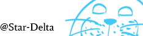

# Star-Deltaのホームページ
1. [このサイトについて](#このサイトについて)
2. [お知らせ](#お知らせ)
   1. [2026/09/06](#20260906)
3. [作成したもの](#作成したもの)
   1. [Markdown-CSS](#markdown-css)
   2. [Markdown\_Preview](#markdown_preview)
4. [管理者について](#管理者について)
   1. [ライセンス](#ライセンス)

## このサイトについて
Star-Deltaが管理するホームページです。  

当サイトはリンクフリーです。  
リンクを作成される際は、`https://star-delta.github.io`をご指定いただき、必要に応じて以下のバナーをご利用ください。  

## お知らせ
### 2026/09/06
適当に作って長らく放置していたこのサイト周りの色々を整理しました。  
LLMマジ便利。

## 作成したもの
### [Markdown-CSS](https://github.com/Star-Delta/Markdown-CSS)
このページでも使用しているCSS  

### [Markdown_Preview](https://github.com/Star-Delta/Markdown_Preview)
WebブラウザでMarkdownをプレビューするツール

## 管理者について
`Star-Delta`という名前で、主に以下のようなアイコンを使用して活動しています。  

| 所有アカウント | UserName                                                           |
| ---------------- | ------------------------------------------------------------------ |
| GitHub           | [Star-Delta](https://github.com/Star-Delta)                        |
| Misskey.io       | [@StarDelta@misskey.io](https://misskey.io/@StarDelta)             |
| ぼすきー         | [@StarDelta@voskey.icalo.net](https://voskey.icalo.net/@StarDelta) |
| Twitter          | [@StarDelta_twit](https://twitter.com/StarDelta_twit)              |
| niconico         | [Star-Delta](https://www.nicovideo.jp/user/87317)                  |

### ライセンス
別途記載のあるものを除き、本サイトのコンテンツのうち
Star-Deltaが著作権を有するものは、
[CC BY-ND 4.0](https://creativecommons.org/licenses/by-nd/4.0/deed.ja)
の下で提供します。

ライセンス全文は [LICENSE](LICENSE) を参照してください。
第三者の著作物およびリンク先の制作物には、それぞれの利用条件が適用されます。

